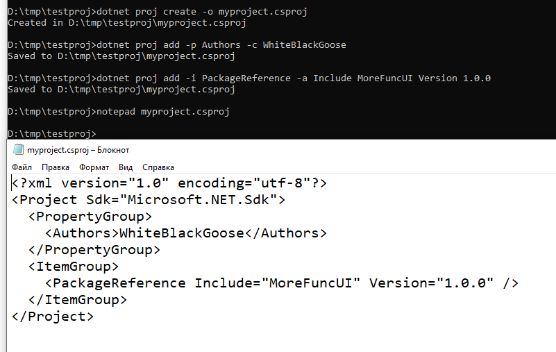

# dotnet-proj

CLI tool to work with Directory.Build.props/csproj/fsproj etc.



## Install

Install:
```
dotnet tool install dotnet-proj-cli --global --prerelease
```
(not to confuse with another tool, `dotnet-proj`!)

Update:
```
dotnet tool update dotnet-proj-cli --global --prerelease
```

## Use

### Create

```
dotnet proj create Directory.Build.props
```

```
dotnet proj create MyProject.csproj
```

### Add

```
dotnet proj add --object ./Directory.Build.props --property TargetFramework --value net5.0
```

Or, for instance, you want to add a package

```
dotnet proj add -o ./Directory.Build.props -i PackageReference -a Include xUnit Version 1.0.0
```

Or, let it auto-detect the file (if the choice is obvious):

```
dotnet proj add -i None -a Include "../obj"
```